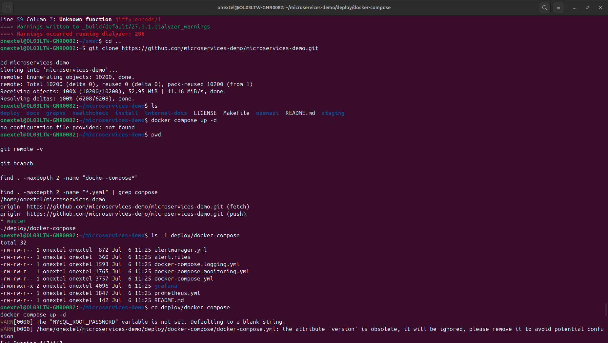
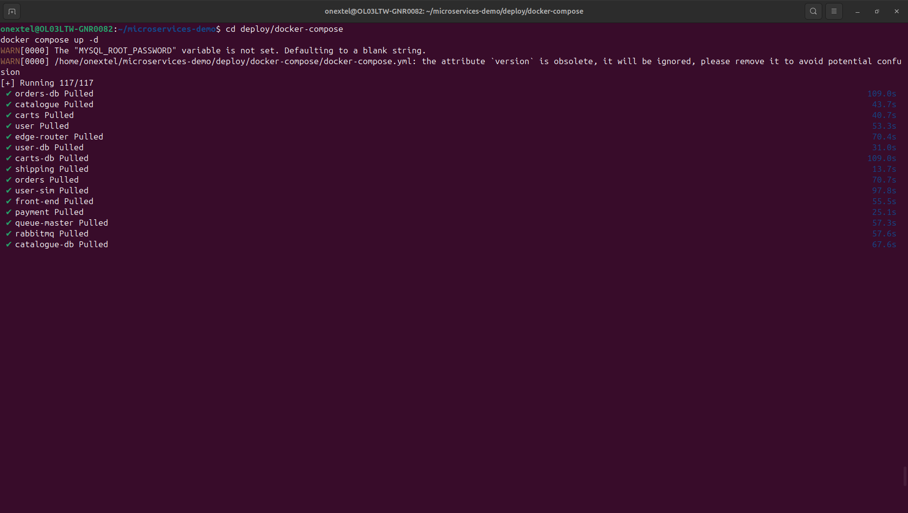
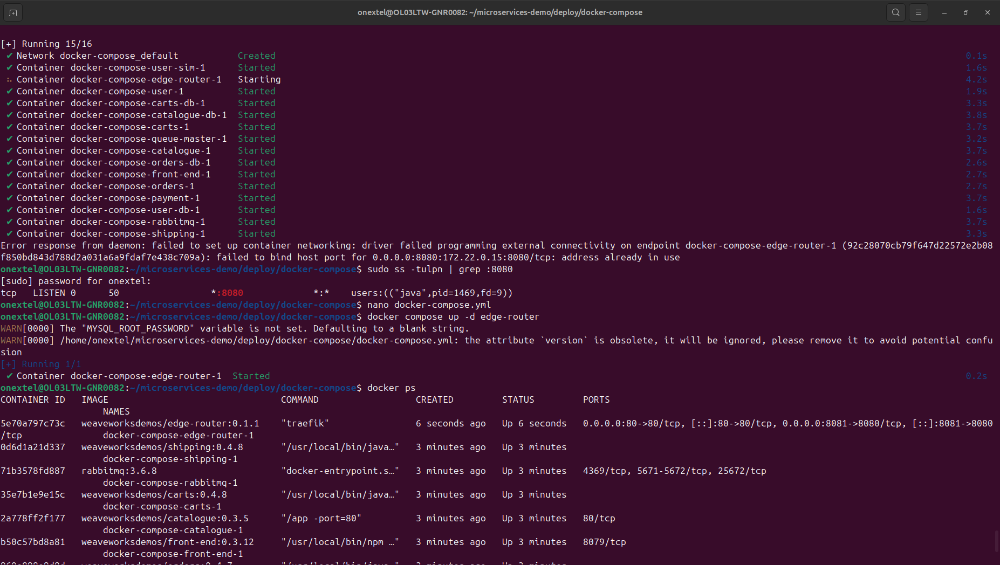
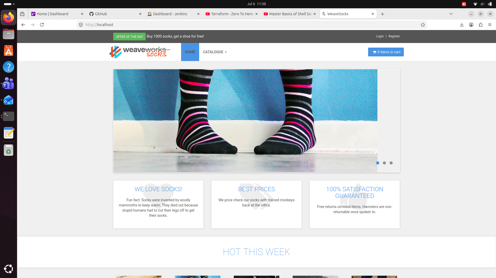

# Docker Compose Microservices Learning

> Hands-on deployment and learning project using the open-source **Sock Shop** microservices application.

---

## Project Overview

This repository documents my hands-on experience deploying the **Sock Shop** microservices application using **Docker Compose** on Ubuntu.

The objective of this project was **not to develop the application**, but to understand how production-style microservices are deployed, networked, and managed using Docker Compose.

**Original Repository:** https://github.com/microservices-demo/microservices-demo

This repository contains my deployment notes, troubleshooting steps, screenshots, and key lessons learned.

---

## Objectives

- Learn Docker and Docker Compose
- Deploy a multi-container application
- Understand Docker networking
- Explore Traefik reverse proxy
- Troubleshoot deployment issues
- Verify application deployment locally

---

## Technologies Used

- Docker
- Docker Compose
- Ubuntu Linux
- Git & GitHub
- Traefik
- RabbitMQ
- MySQL
- Microservices

---

## Deployment Steps

```bash
git clone https://github.com/microservices-demo/microservices-demo.git

cd microservices-demo/deploy/docker-compose

docker compose up -d

docker ps
```

Access the application:

```
http://localhost:8081
```

---

## Challenges Faced

### Docker Compose file not found

**Cause:** Ran Docker Compose from the wrong directory.

**Solution:** Changed to `deploy/docker-compose`.

---

### Port 8080 already in use

**Cause:** Jenkins was using port **8080**.

**Solution:** Updated the Edge Router port mapping to expose the application on **8081**.

---

### MYSQL_ROOT_PASSWORD warning

The deployment displayed a warning because the variable was not set. The application still deployed successfully.

---

## What I Learned

- Docker images and containers
- Docker Compose
- Multi-container deployments
- Docker networking
- Port mapping
- Container logs
- Reverse proxy concepts
- Linux command-line usage
- Troubleshooting container deployments

---

# Screenshots

## Docker Compose Deployment



---

## All Containers Running



---

## Resolving Port Conflict



---

## Successfully Running Application



---

## Skills Demonstrated

- Docker
- Docker Compose
- Linux
- Git
- GitHub
- Container Networking
- Troubleshooting
- Microservices Deployment

---

## Future Improvements

- Kubernetes Deployment
- Jenkins CI/CD
- Helm
- Prometheus & Grafana
- Trivy

---

## Acknowledgements

The Sock Shop application was developed by the **Microservices Demo** project.

This repository documents **my deployment process and learning experience** and is intended for educational purposes.
